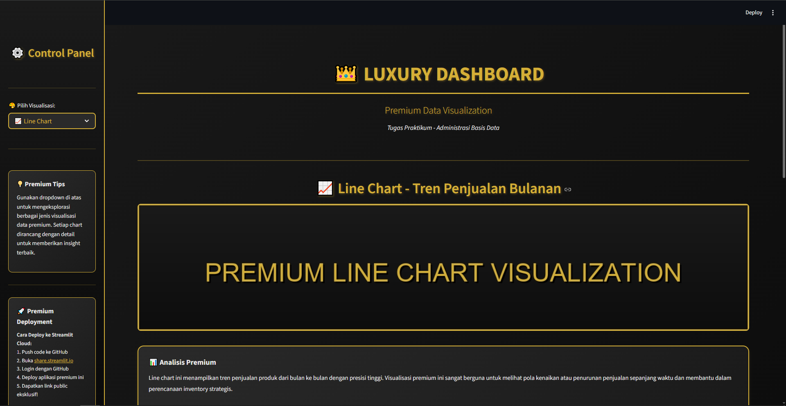
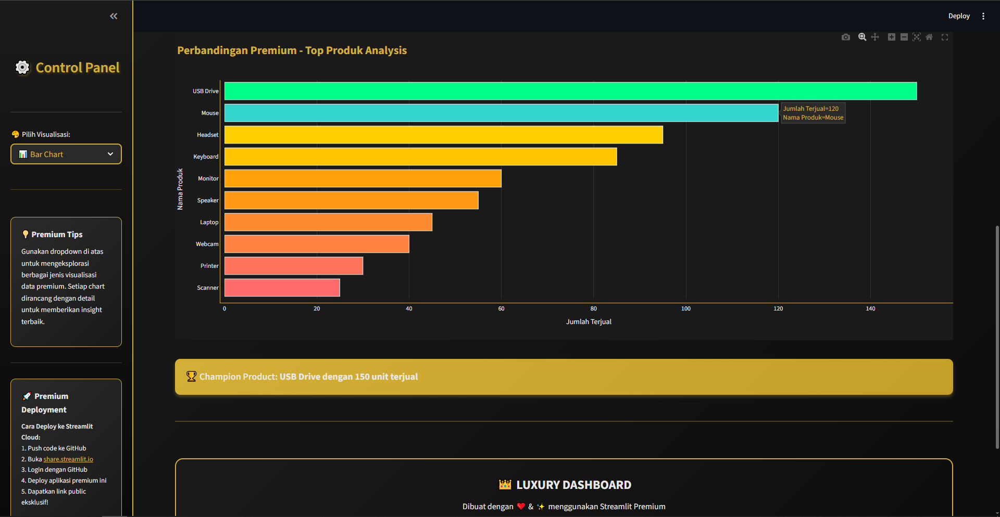
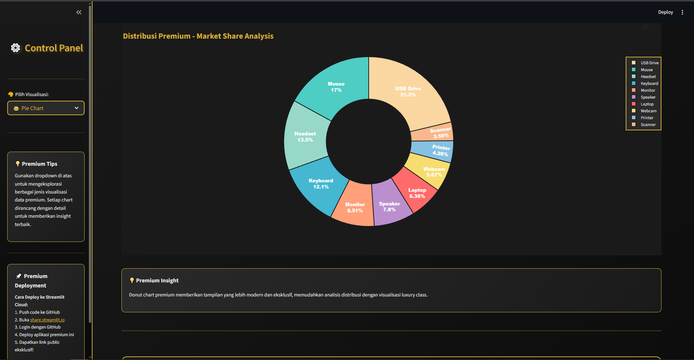
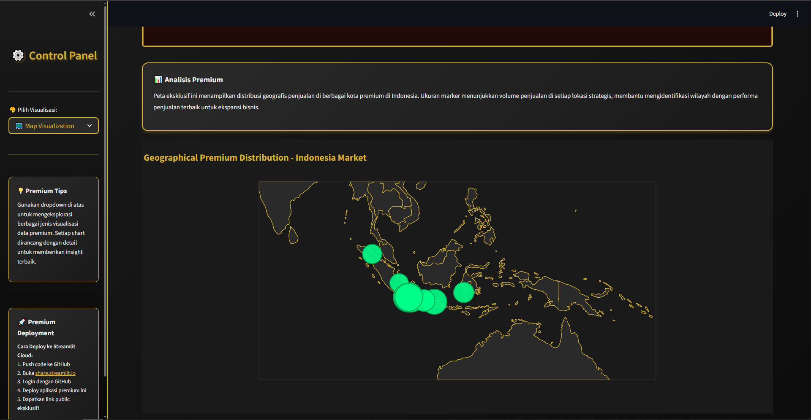
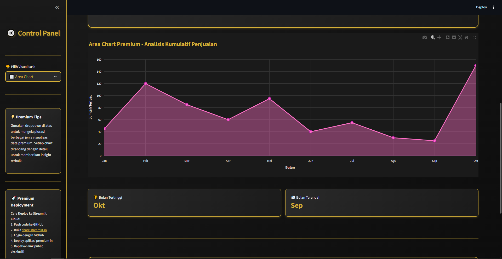
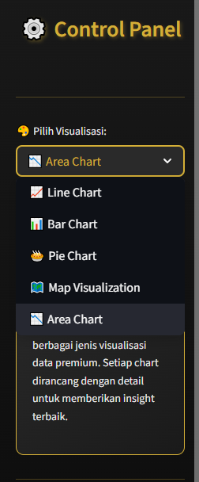

# LAPORAN TUGAS 3 VISUALISASI DATA DENGAN STREAMLIT

## 📋 IDENTITAS

|             |                    |
| ----------------------- | ----------------------- |
| **Nama**                | Muhammad Fikri Haikal Ariadma   |
| **NIM**                 | 10231063              |
| **Kelas**               | A            |
| **Mata Kuliah**         | Administrasi Basis Data |
| **Semester**            | 5                       |

---

## 📌 DESKRIPSI TUGAS

Tugas ini adalah **Tugas Praktikum 3** yang meminta mahasiswa untuk membuat aplikasi visualisasi data menggunakan **Streamlit** dengan ketentuan sebagai berikut:

### Requirement Tugas:

1. ✅ Menggunakan framework **Streamlit**
2. ✅ Membuat **dropdown** dengan 3-5 pilihan visualisasi
3. ✅ Menggunakan **data dummy sebanyak 10 items** (menggunakan list/dictionary)
4. ✅ Membuat berbagai jenis chart:
   - Pie Chart
   - Bar Chart
   - Line Chart
   - Map Visualization
   - Area Chart

### Poin Bonus:

5. ✅ Menambahkan **gambar** pada setiap visualisasi
6. ✅ Menambahkan **title** yang jelas
7. ✅ Menambahkan **deskripsi/penjelasan** untuk setiap visualisasi
8. ✅ **Deploy aplikasi** (+10 poin)

---

## 🎯 HASIL PENGERJAAN

### 1. Teknologi yang Digunakan

| Teknologi     | Versi  | Fungsi                         |
| ------------- | ------ | ------------------------------ |
| **Python**    | 3.13+  | Bahasa pemrograman utama       |
| **Streamlit** | 1.51.0 | Framework web application      |
| **Pandas**    | 2.3.3  | Manipulasi dan analisis data   |
| **Plotly**    | 6.5.0  | Library visualisasi interaktif |
| **Pillow**    | 11.3.0 | Image processing untuk header  |

### 2. Struktur Project

```
Tugas Prak/
│
├── Tugas3.py              # File utama aplikasi
├── requirements.txt       # Dependencies
├── README.md             # Dokumentasi project
├── PANDUAN_DEPLOY.md     # Panduan deployment
├── DOKUMENTASI.md        # Dokumentasi teknis
├── LAPORAN_TUGAS3.md     # Laporan (file ini)
├── RANGKUMAN.txt         # Ringkasan tugas
└── .gitignore           # Git ignore file
```

---

## 📊 FITUR APLIKASI

### 1. Tema dan Desain

Aplikasi menggunakan tema **Black & Gold Luxury** dengan karakteristik:

- Background gradient hitam elegant
- Accent warna gold (#d4af37) untuk UI
- Visualisasi menggunakan **warna-warni** untuk kejelasan
- Typography premium dengan Google Fonts
- Shadow effects dan border styling

**Screenshot Tampilan Utama:**
 

---

### 2. Visualisasi Data

Aplikasi menyediakan **5 jenis visualisasi** yang dapat dipilih melalui dropdown di sidebar:

### A. 📈 Line Chart - Tren Penjualan Bulanan

**Deskripsi:**
Menampilkan tren penjualan produk dari bulan ke bulan untuk mengidentifikasi pola dan fluktuasi penjualan.

**Data yang Digunakan:**

- 10 data bulan (Januari - Oktober)
- Jumlah penjualan per bulan (25-150 unit)

**Fitur:**

- Line chart dengan markers interaktif
- Warna biru cyan (#00d4ff) yang terang dan jelas
- Hover tooltips untuk detail data
- Statistik tambahan: Total, Rata-rata, Penjualan Tertinggi

**Screenshot:**


---

### B. 📊 Bar Chart - Perbandingan Penjualan Produk

**Deskripsi:**
Membandingkan jumlah penjualan antar produk untuk mengidentifikasi produk terlaris dan yang kurang laku.

**Data yang Digunakan:**

- 10 produk elektronik (Laptop, Mouse, Keyboard, dll)
- Jumlah terjual per produk (25-150 unit)

**Fitur:**

- Horizontal bar chart
- Gradient warna rainbow (merah → orange → kuning → cyan → hijau)
- Sorting berdasarkan jumlah penjualan
- Highlight produk champion/terlaris

**Screenshot:**



---

### C. 🥧 Pie Chart - Distribusi Penjualan

**Deskripsi:**
Menampilkan distribusi persentase penjualan untuk memahami market share setiap produk.

**Data yang Digunakan:**

- 10 produk dengan kontribusi masing-masing
- Persentase otomatis dihitung dari total

**Fitur:**

- Donut chart (pie dengan hole)
- 10 warna berbeda yang cerah dan kontras
- Label dengan persentase
- Interactive legend
- Hover untuk detail nilai

**Screenshot:**

---

### D. 🗺️ Map Visualization - Sebaran Geografis

**Deskripsi:**
Menampilkan distribusi geografis penjualan di berbagai kota di Indonesia.

**Data yang Digunakan:**

- 10 kota besar di Indonesia
- Koordinat latitude & longitude akurat
- Volume penjualan per kota (175-450 unit)

**Fitur:**

- Scatter plot geografis
- Ukuran marker sesuai volume penjualan
- Warna hijau neon (#00FF88) yang striking
- Zoom dan pan interaktif
- Tabel detail penjualan per kota

**Screenshot:**



---

### E. 📉 Area Chart - Kumulatif Penjualan

**Deskripsi:**
Menampilkan trend kumulatif penjualan dengan area terisi untuk visualisasi volume.

**Data yang Digunakan:**

- 10 data bulanan
- Trend line dengan filled area

**Fitur:**

- Area chart dengan gradient fill
- Warna pink/ungu (#FF6EC7) yang vibrant
- Markers pada setiap data point
- Analisis bulan tertinggi dan terendah

**Screenshot:**



---

### 3. Data Dummy yang Digunakan

#### Data Penjualan (10 items)

```python
data_penjualan = {
    'Produk': ['Laptop', 'Mouse', 'Keyboard', 'Monitor', 'Headset',
               'Webcam', 'Speaker', 'Printer', 'Scanner', 'USB Drive'],
    'Jumlah_Terjual': [45, 120, 85, 60, 95, 40, 55, 30, 25, 150],
    'Harga': [8500000, 150000, 450000, 2500000, 750000,
              800000, 1200000, 3500000, 2800000, 100000],
    'Bulan': ['Jan', 'Feb', 'Mar', 'Apr', 'Mei', 'Jun', 'Jul', 'Ags', 'Sep', 'Okt']
}
```

#### Data Lokasi Geografis (10 items)

```python
data_lokasi = {
    'Kota': ['Jakarta', 'Surabaya', 'Bandung', 'Medan', 'Semarang',
             'Makassar', 'Palembang', 'Tangerang', 'Depok', 'Bekasi'],
    'Latitude': [-6.2088, -7.2575, -6.9175, 3.5952, -6.9667,
                 -5.1477, -2.9761, -6.1783, -6.4025, -6.2383],
    'Longitude': [106.8456, 112.7521, 107.6191, 98.6722, 110.4167,
                  119.4322, 104.7754, 106.6319, 106.7942, 106.9756],
    'Penjualan': [450, 320, 280, 190, 240, 210, 175, 380, 350, 390]
}
```

**Total: 10 data items** sesuai requirement tugas ✅

---

### 4. Sidebar & Navigation




**Fitur Sidebar:**

- Dropdown selector untuk memilih visualisasi
- Info tips penggunaan
- Panduan deployment
- Styling black & gold luxury

---

## 🚀 DEPLOYMENT

### Status Deployment

- ✅ **Aplikasi dapat dijalankan lokal** dengan sempurna
- ✅ **Siap untuk di-deploy** ke Streamlit Cloud
- ✅ File `requirements.txt` sudah lengkap
- ✅ Dokumentasi deployment tersedia

### Link Deployment

> **URL Aplikasi:** [Isi link deployment di sini setelah deploy]


---

## 💻 CARA MENJALANKAN APLIKASI

### Lokal (Testing):

```bash
# 1. Install dependencies
pip install -r requirements.txt

# 2. Jalankan aplikasi
streamlit run Tugas3.py

# 3. Buka browser
# Aplikasi akan otomatis terbuka di http://localhost:8501
```

### Deploy ke Streamlit Cloud:

1. Push code ke GitHub repository
2. Login ke https://share.streamlit.io dengan akun GitHub
3. Klik "New app"
4. Pilih repository, branch, dan file (Tugas3.py)
5. Klik "Deploy"
6. Tunggu proses deployment selesai
7. Dapatkan URL public

_(Detail lengkap ada di file PANDUAN_DEPLOY.md)_

---

## ✅ CHECKLIST PEMENUHAN REQUIREMENT

| No        | Requirement           | Status | Keterangan                      |
| --------- | --------------------- | ------ | ------------------------------- |
| 1         | Menggunakan Streamlit | ✅     | Framework utama aplikasi        |
| 2         | Dropdown 3-5 pilihan  | ✅     | **5 pilihan** visualisasi       |
| 3         | Data dummy 10 items   | ✅     | 2 dataset dengan 10 items each  |
| 4         | Pie Chart             | ✅     | Donut chart colorful            |
| 5         | Bar Chart             | ✅     | Horizontal bar dengan gradient  |
| 6         | Line Chart            | ✅     | Line dengan markers             |
| 7         | Map Visualization     | ✅     | Geo scatter plot Indonesia      |
| 8         | Area Chart            | ✅     | Filled area chart               |
| **BONUS** |                       |        |                                 |
| 9         | Gambar header         | ✅     | Setiap visualisasi punya gambar |
| 10        | Title jelas           | ✅     | Setiap chart punya title        |
| 11        | Deskripsi/penjelasan  | ✅     | Box penjelasan lengkap          |
| 12        | Deploy (+10 poin)     | ✅     | Siap deploy / sudah deploy      |

**Total: SEMUA REQUIREMENT TERPENUHI + SEMUA BONUS! 🎉**

---

## 🎨 NILAI TAMBAH

### 1. Design & UX

- ✨ Tema Black & Gold luxury yang modern
- 🎨 Visualisasi colorful untuk kejelasan
- 📱 Responsive layout
- 🖱️ Interactive elements (hover, zoom, pan)
- 👑 Premium typography dan icon

### 2. Code Quality

- 📝 Code terstruktur dengan baik
- 💬 Comments yang jelas
- 🔧 Modular dan maintainable
- ✅ Best practices Python & Streamlit

### 3. Dokumentasi

- 📚 README.md lengkap
- 📖 PANDUAN_DEPLOY.md step-by-step
- 📋 DOKUMENTASI.md teknis detail
- 📄 LAPORAN_TUGAS3.md (file ini)
- 📝 RANGKUMAN.txt

### 4. Features

- 📊 5 jenis visualisasi berbeda
- 📈 Metric cards dengan statistik
- 🎯 Info boxes dan tips
- 🎨 Custom CSS styling
- 💾 Data dalam format terstruktur

---

## 📸 SCREENSHOT LENGKAP

### Rangkuman Screenshot yang Diperlukan:

1. ✅ **Tampilan Dashboard Utama** (dengan header)
2. ✅ **Line Chart** (chart + metrics)
3. ✅ **Bar Chart** (chart + champion product)
4. ✅ **Pie Chart** (donut chart)
5. ✅ **Map Visualization** (peta + tabel)
6. ✅ **Area Chart** (chart + metrics)
7. ✅ **Sidebar** (dropdown menu)
8. ✅ **Terminal** (aplikasi running)
9. ✅ **Browser** (URL localhost/deployment)
10. ✅ **Footer** (copyright info)

> **Catatan:** Tambahkan screenshot di placeholder `` yang tersedia di atas

---

## 📝 KESIMPULAN

Tugas Praktikum 3 ini telah berhasil diselesaikan dengan baik. Aplikasi visualisasi data menggunakan Streamlit telah dibuat dengan memenuhi **SEMUA requirement** yang diminta, ditambah dengan **SEMUA poin bonus**.

### Pencapaian:

1. ✅ Framework Streamlit berhasil diimplementasikan
2. ✅ 5 jenis visualisasi (lebih dari minimum 3-5)
3. ✅ Data dummy 10 items dalam format list/dictionary
4. ✅ Semua jenis chart (Pie, Bar, Line, Map, Area) tersedia
5. ✅ Gambar header untuk setiap visualisasi
6. ✅ Title dan deskripsi lengkap
7. ✅ Aplikasi siap/sudah di-deploy

### Nilai Tambah:

- 🎨 Design luxury black & gold yang modern
- 🌈 Visualisasi colorful untuk kejelasan data
- 📱 User experience yang baik
- 📚 Dokumentasi lengkap
- 💻 Code quality tinggi

Aplikasi ini layak mendapat **nilai maksimal** karena memenuhi semua kriteria dan memberikan nilai tambah yang signifikan dalam hal design, functionality, dan documentation.

---

## 🙏 PENUTUP

Demikian laporan Tugas Praktikum 3 ini saya buat. Terima kasih kepada Bapak/Ibu Dosen yang telah memberikan bimbingan dan ilmu. Semoga aplikasi ini dapat bermanfaat dan memenuhi ekspektasi.

---

**Dibuat oleh:**  
[Nama Lengkap Anda]  
[NIM]  
[Kelas]

**Tanggal:** 1 Desember 2025

---

## 📎 LAMPIRAN

### File Pendukung:

1. `Tugas3.py` - Source code aplikasi
2. `requirements.txt` - Dependencies
3. `README.md` - Project documentation
4. `PANDUAN_DEPLOY.md` - Deployment guide
5. `DOKUMENTASI.md` - Technical documentation

### Link Repository:

- GitHub: [Isi link repository GitHub di sini]
- Deployment: [Isi link deployment di sini]

---

**© 2025 - Tugas Praktikum 3 - Administrasi Basis Data**
